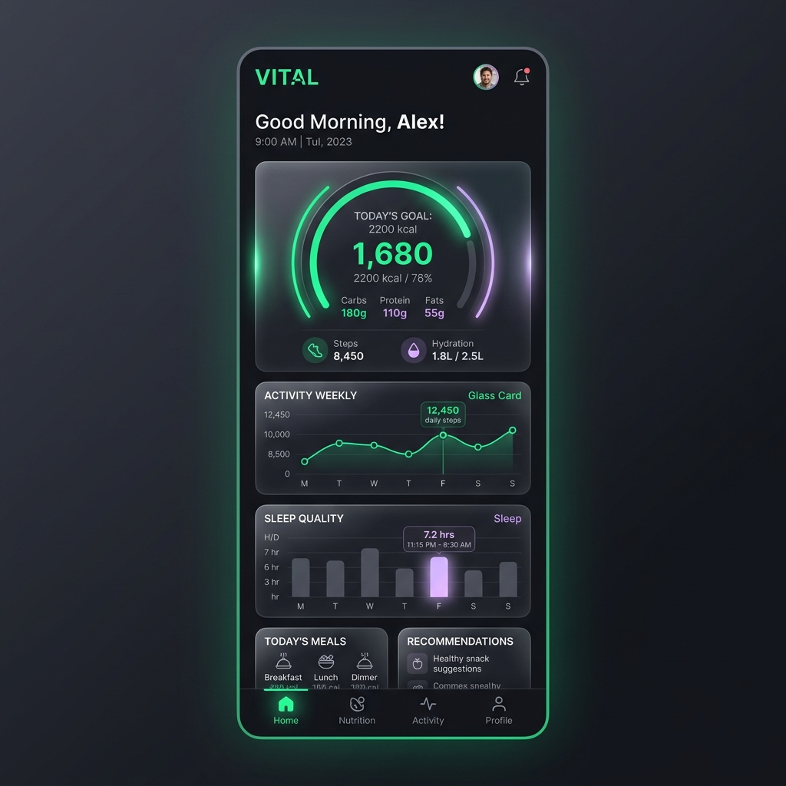

# 🥗 NutriJoy

[](https://nextjs.org/)
[](https://serwist.github.io/)
[](https://www.typescriptlang.org/)
[](#license)

NutriJoy is a premium, mobile-first **Progressive Web Application (PWA)** designed to be a comprehensive nutrition, fitness, and holistic wellness tracking companion. It combines state-of-the-art web capabilities with rich glassmorphism aesthetics, fluid micro-animations, and personalized AI-driven health insights to help you track and optimize your daily wellness rituals.

---

## 📱 Preview

<div align="center">
  
</div>

---

## ✨ Premium Features

- 🥗 **Advanced Food Logging**: Log meals, track daily calories, water intake, and detailed macronutrients/micronutrients. Supports international decimal commas for natural entry.
- ⚡ **AI Wellness Coach**: Dynamic, context-aware AI insights engine offering tailored wellness suggestions and daily nudges based on your logs.
- 🏃‍♀️ **Activity Tracking**: Track active minutes, customized workout cards, and weekly exercise trends with modern graphical reports.
- 🛌 **Sleep & Recovery**: Deep logs for sleep duration, quality, sleep scheduling, and trends.
- 🩸 **Cycle Tracker**: Built-in holistic tracker for cycles and physiological wellness.
- 🧘 **Self-Care Rituals**: Interactive, daily checklist for mindfulness, hydration, steps, and mental fitness.
- 📶 **PWA & Offline Capability**: Built on Serwist for persistent caching, instant loads, and reliable offline capabilities even in zero-connectivity environments.

---

## 🛠️ Tech Stack

- **Framework**: Next.js 16 (App Router, Turbopack)
- **Runtime & UI**: React 19, Framer Motion, Radix UI Primitives, Lucide Icons, Canvas Confetti
- **Styling**: Tailwind CSS (Tailwind CSS Animate)
- **Data Visualization**: Recharts
- **PWA Service Worker**: Serwist
- **Quality & Type Safety**: TypeScript 5, ESLint 9, Zod

---

## 🚀 Getting Started

### Prerequisites

Ensure you have [Node.js](https://nodejs.org/) installed (LTS recommended).

### Installation

1. **Clone the repository:**

   ```bash
   git clone https://github.com/nichsedge/nutrijoy.git
   cd nutrijoy
   ```

2. **Install dependencies:**

   ```bash
   npm install
   ```

3. **Run the development server:**
   ```bash
   npm run dev
   ```
   Open [http://localhost:9002](http://localhost:9002) in your browser to explore the dashboard.

---

## 🧪 Quality Standards

Run the following checks locally before contributing or opening a PR:

- **Typecheck**: Verify TypeScript static analysis.
  ```bash
  npm run typecheck
  ```
- **Lint**: Run ESLint for syntax cleanliness.
  ```bash
  npm run lint
  ```
- **Test**: Execute the test runner using tsx.
  ```bash
  npm run test
  ```

---

## 📄 License

This project is licensed under the MIT License - see the LICENSE file for details.
